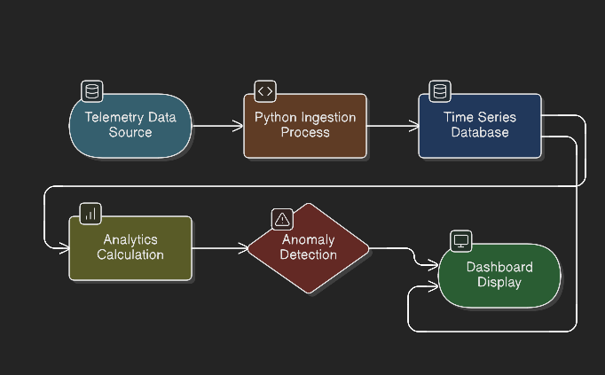

# Predictive Maintenance Using GridDB

## Problem Statement

Unexpected machine failures cause significant downtime and operational cost.
This project uses **real-time sensor telemetry** to detect anomalies and predict potential failures **before they occur**, enabling proactive maintenance.


## Dataset Used

We use the **Microsoft Azure Predictive Maintenance Telemetry Dataset**, which contains time-series sensor data collected from industrial machines.

**Dataset characteristics:**

* Hourly telemetry
* **100 machines**
* **1 year of data**

**Sensor fields:**

* `datetime` – timestamp of sensor reading
* `machineID` – unique machine identifier
* `volt` – voltage level
* `rotate` – rotational speed
* `pressure` – system pressure
* `vibration` – vibration level

This dataset closely represents real-world industrial IoT telemetry and is well suited for predictive maintenance use cases.


## Key Data Insights (EDA)

Basic exploratory data analysis revealed:

* Sensor readings are **stable within normal operating ranges** most of the time
* **Vibration and rotation** exhibit occasional sharp spikes, indicating abnormal machine behavior
* Sensors show **very low correlation**, meaning failures can be detected by monitoring each sensor independently
* **Vibration** is the strongest early indicator of potential mechanical issues

These patterns align with real industrial systems, where gradual wear or sudden faults cause sensor deviations prior to failure.


## Anomaly Detection Logic

### Detection Strategy

A **statistical threshold-based approach** is used, derived from historical telemetry:

* **Warning threshold:**
  Mean + 2 × Standard Deviation
* **Critical threshold:**
  Mean + 3 × Standard Deviation

To reduce false positives, alerts are triggered only when thresholds are exceeded consistently.

### Alert Levels

* **Warning:** Early indication of abnormal behavior
* **Critical:** Immediate maintenance required

This approach is simple, explainable, and suitable for industrial environments.


## System Architecture

The system ingests telemetry data, stores it in GridDB, performs analytics in Python, and visualizes results in real time.




## Implementation Details

### Data Ingestion

* The telemetry CSV (`PdM_telemetry.csv`) is ingested into **GridDB** using the **GridDB Python Connector**
* Data is stored in a **TimeSeries container** named `machine_telemetry`

**Container schema:**

* `datetime` (TIMESTAMP, row key)
* `machineID` (INTEGER)
* `volt` (FLOAT)
* `rotate` (FLOAT)
* `pressure` (FLOAT)
* `vibration` (FLOAT)

GridDB stores both **historical** and **live streaming** telemetry efficiently.


### Real-Time Data Simulation

A Python script simulates real-world IoT behavior by continuously inserting new sensor readings into GridDB at fixed intervals.

This mimics how industrial machines push telemetry data in production environments.


### Real-Time Analytics

For a selected machine:

* Recent telemetry is fetched directly from GridDB
* Mean and standard deviation of vibration are computed
* Dynamic thresholds are calculated
* Alerts are generated based on the latest sensor value

All analytics are performed in Python using data queried from GridDB.


### Dashboard (Streamlit)

A **Streamlit dashboard** provides real-time monitoring of machine health.

**Dashboard features:**

* Machine ID selection (1–100)
* Configurable number of recent records
* Live vibration time-series plot
* Warning and critical threshold overlays
* Real-time machine status:

  * Normal
  * Warning
  * Critical

#### Normal Operating State


#### Critical Operating State


---

### GridDB Data Verification

Telemetry ingestion and querying were verified directly from the GridDB TimeSeries container.


---

## Project Structure

```
GridDB-Hackathon/
├── data/
│   └── PdM_telemetry.csv
├── experiments/
│   ├── 1_create_container.py
│   ├── 2_load_csv_to_griddb.py
│   ├── 3_verify_data.py
│   └── 4_streamlit.py
├── scripts/
│   └── simulate_iot_sensor_data.py
├── images/
│   ├── architecture.png
│   ├── live_dashboard_normal.png
│   ├── live_dashboard_critical.png
│   └── griddb_data_verify.png
├── README.md
```


## Results

* Machine vibration anomalies are detected in near real time
* Alerts are triggered immediately when thresholds are crossed
* GridDB efficiently handles time-series ingestion and querying
* The solution is **simple, explainable, and scalable** for industrial predictive maintenance


