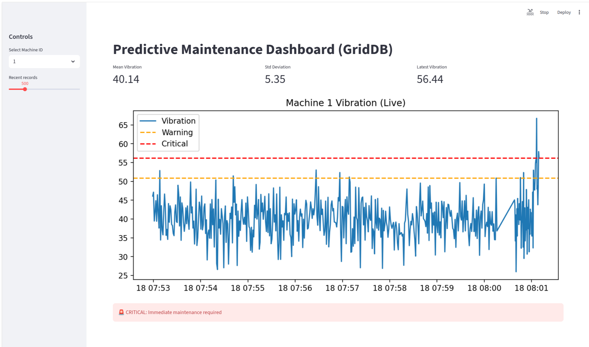
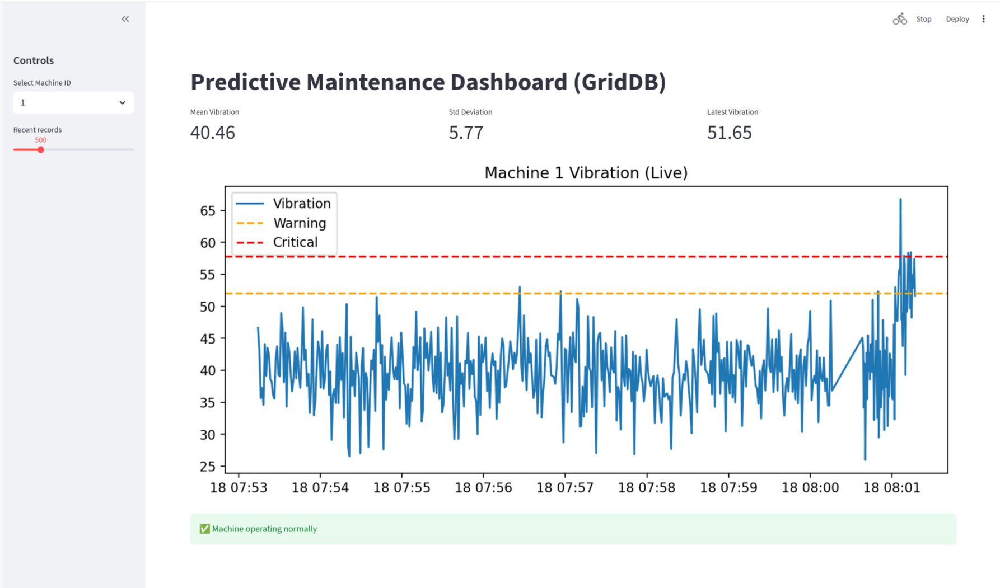

## Problem Statement

Unexpected machine failures cause downtime and cost. We use real-time sensor telemetry to detect anomalies and predict failures before they happen.

## Dataset Used

We use the **Microsoft Azure Predictive Maintenance Telemetry Dataset**, which contains time-series sensor data collected from industrial machines.
The dataset includes hourly telemetry from **100 machines** over **one year**, with the following sensors:

- `datetime` – timestamp of sensor reading
- `machineID` – unique machine identifier
- `volt` – voltage level
- `rotate` – rotational speed
- `pressure` – system pressure
- `vibration` – vibration level

This dataset closely represents real industrial IoT telemetry and is well suited for predictive maintenance use cases.

## Key Data Insights (EDA)

Basic exploratory analysis revealed:

- Sensor readings remain **stable within normal operating ranges** for most of the time
- **Vibration and rotation** show occasional sharp spikes, indicating abnormal machine behavior
- Sensors have **very low correlation**, meaning failures can be detected by monitoring each sensor independently
- Vibration is the **strongest early indicator** of potential mechanical issues

These patterns align with real-world industrial systems, where gradual wear or sudden faults cause sensor deviations before failure.

## Logic

### Anomaly Detection Strategy

We use a **statistical threshold-based approach** derived from historical telemetry:

- **Warning threshold:** Mean + 2 × Standard Deviation
- **Critical threshold:** Mean + 3 × Standard Deviation

To avoid false alerts, anomalies are triggered only when thresholds are exceeded for **multiple consecutive readings**.

### Alert Logic

- **Warning Alert:** Early indication of abnormal behavior
- **Critical Alert:** Maintenance required to prevent failure


## Implementation

### Data Ingestion

The telemetry CSV (`PdM_telemetry.csv`) is loaded into **GridDB** using a Python script.
Each row is inserted into a **TimeSeries container** (`machine_telemetry`) with the following schema:

- `datetime` (TIMESTAMP, row key)
- `machineID` (INTEGER)
- `volt` (FLOAT)
- `rotate` (FLOAT)
- `pressure` (FLOAT)
- `vibration` (FLOAT)

GridDB is used to store both **historical** and **streaming** sensor data.

### Real-Time Data Simulation

A Python script simulates live machine telemetry by continuously inserting new vibration values into GridDB at fixed time intervals.

This simulates how industrial machines push sensor data in real time.

### Real-Time Analytics

For a selected machine:

- Recent telemetry is fetched from GridDB
- Mean and standard deviation of vibration are computed
- Dynamic thresholds are calculated:

  - Warning = Mean + 2 × Std
  - Critical = Mean + 3 × Std

- Alerts are generated based on the latest value

All analytics are computed in Python using data retrieved directly from GridDB.

### Dashboard

A Streamlit dashboard is used to visualize machine health.

Features:

- Select machine ID (1–100)
- Select number of recent records
- Live vibration time-series plot
- Warning and critical threshold lines
- Real-time status indicator (Normal / Warning / Critical)

The dashboard reflects new data as it is written into GridDB.

## Project Structure

```
GridDB-Hackathon/
├── data/
│   └── PdM_telemetry.csv
├── experiments/
│   ├── 1_create_container.py
│   ├── 2_load_csv_to_griddb.py
│   ├── 3_verify_data.py
│   └── 4_streamlit.py
├── scripts/
│   └── simulate_iot_sensor_data.py
├── README.md
```

---

## Results

- Machine vibration anomalies are detected in near real time
- Alerts are triggered immediately when thresholds are crossed
- GridDB handles time-series ingestion and queries efficiently
- The approach is simple, explainable, and suitable for industrial monitoring

---

## Screenshots

### Real-Time Predictive Maintenance Dashboard
Live Streamlit dashboard showing machine vibration trends with warning and critical thresholds.




### GridDB Telemetry Verification
Sensor data successfully ingested and queried from GridDB TimeSeries container.


